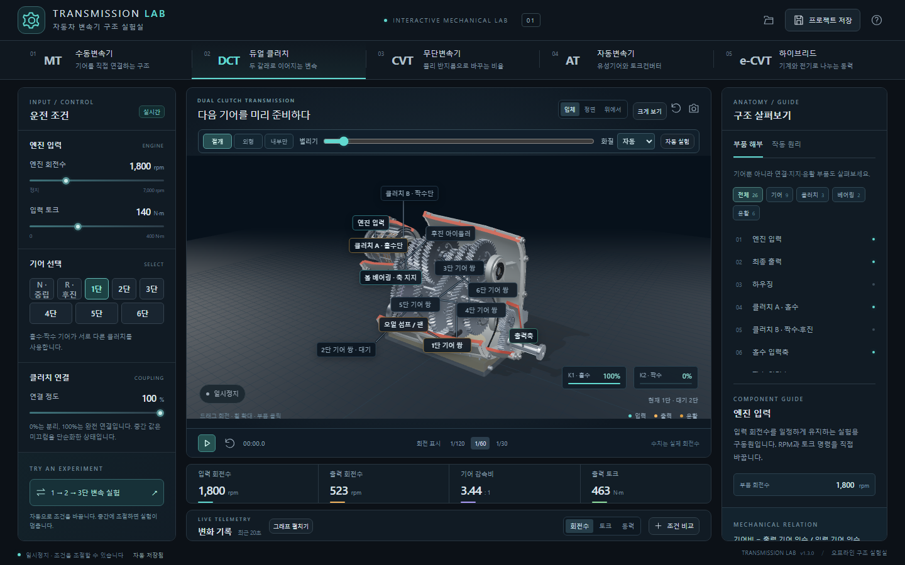
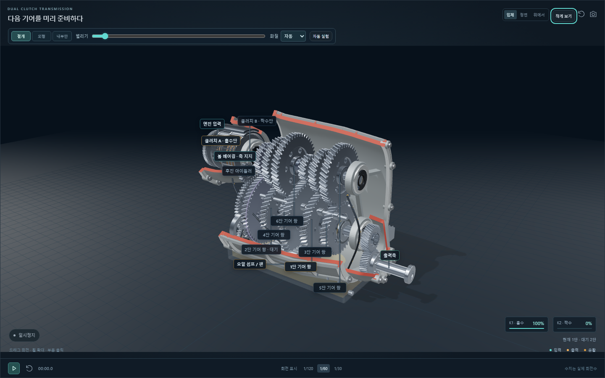

# Transmission Lab

자동차 변속기의 내부를 열어 보고 회전수, 토크, 기어와 변속비를 바꾸는 **Windows 3D 체험·실험 앱**입니다. MT, DCT, CVT, AT, eCVT의 대표 구조와 동력 연결을 한 작업대에서 비교합니다.

**1.4.0 소스 개선본**에서는 톱니 치면과 베어링의 세부 운동을 개선했습니다. 부품 설명의 **부품 단독 확대**로 관찰하고 **작동 상세**에서 클러치 미끄럼·손실, 톱니 통과 빈도, CVT 감김각·접선력, 유성기어 고정부 반력을 읽습니다. [개선·검증 기록](docs/detail-refinement.md)에 변경 범위와 검사 결과를 기록합니다. 아래 1.3.0 설치·업데이트 평가는 기존 공개 릴리스의 기록입니다.

**1.3.0 · 일반 체험용 기술 검증 완료.** 다섯 구조의 화면·조작·저장·독립 EXE·설치 파일 내용 대조와 기존 설치본 업데이트를 확인했습니다. 배포 위치는 [GitHub Releases](https://github.com/Ulsancl/transmission-lab/releases)이며 설치 파일의 실제 제공 여부는 해당 페이지에서 확인합니다. 검사 환경과 제한은 [제품 평가 기록](docs/consumer-release.md)에 정리합니다. 기술 검증과 유료 판매 개시는 별도입니다.



*1.3.0의 실제 앱 화면입니다. 아래는 DCT 구조를 크게 연 관찰 화면입니다.*



## 다섯 변속기, 세 가지 관찰 방식

| 형식 | 관찰할 구조 | 조절과 비교 |
| --- | --- | --- |
| MT | 기어, 입력·출력축, 건식 클러치와 동기 장치 | 1–6단, 중립·후진, 클러치 결합 |
| DCT | 홀수·짝수 기어의 두 축과 습식 클러치 | 사전 선택과 두 클러치의 교대 |
| CVT | 두 가변 풀리와 벨트 | 연속 변속비, 접촉 반지름과 출력 회전수 |
| AT | 토크 컨버터와 단일 유성기어 | 네 연결 원리 모드와 컨버터 잠금 |
| eCVT | 엔진·발전기·구동축을 잇는 유성기어 | 모터 회전수, 동력 분배와 배터리 순전력 |

**절개**에서 금속 케이스의 벽 두께와 내부 조립을 보고, **외형**에서 케이스를 닫거나 **내부만**에서 숨길 수 있습니다. 절개 범위와 부품 벌리기로 관찰 공간을 조절합니다. 기본 상태는 불투명한 케이스 안에 부품이 모인 조립 절개입니다.

이름표는 회전 부품을 따라 돌지 않습니다. 부품을 클릭해 설명을 열고 **기어 · 클러치 · 베어링 · 윤활** 분류로 살펴봅니다. 클러치, 베어링, 윤활계와 오일 흐름을 각각 켜고 끌 수 있습니다. 일시정지와 시점 변경으로 맞물림과 동력 경로를 관찰합니다.

장면 옆 **자동 실험**은 해당 형식의 조건을 바꾸고 완료 후 멈춰 실제 전후 회전수·토크·기어비를 보여줍니다. **결과 보기**로 최근 결과를 다시 열고 **전후 비교에 추가**로 보관합니다. **크게 보기** 또는 F로 장면을 확대하고 Escape로 돌아옵니다. **화질**의 자동·정밀·균형·가볍게는 표현을 조절하며 계산값과 부품 구성을 유지합니다. 화면이 오래 지연되어 일시정지 안내가 나오면 재생을 눌러 이어가십시오.

## 설치와 시작

릴리스 페이지에서 `Transmission-Lab-Setup-1.3.0.exe`와 같은 이름의 `.sha256` 확인 파일을 함께 확인합니다. 소스에서 패키징하면 `release/windows/`에 생성됩니다.

설치 파일을 실행해 설치 위치를 선택하고 바탕화면 또는 시작 메뉴의 **Transmission Lab** 아이콘을 클릭합니다. 개인 사용자용 설치이므로 관리자 권한이 필요하지 않습니다. 실행 환경과 3D 라이브러리를 포함하며, 설치된 앱은 첫 실행부터 인터넷·Node.js·별도 서버 없이 사용합니다.

지원 대상은 **Windows x64와 WebGL 2를 지원하는 그래픽 환경**입니다. 디지털 서명 인증서와 자동 업데이트는 포함하지 않습니다. 새 설치 파일로 기존 앱을 갱신하며 사용자 설정을 유지합니다.

1. 변속기 형식을 고릅니다.
2. 입력 조건과 기어 또는 변속비를 바꾸며 출력 수치를 확인합니다.
3. 절개와 부품 선택으로 동력 경로를 살펴봅니다.
4. 프로젝트 JSON으로 관찰 설정과 입력 조건을 보관합니다.

설정은 `%APPDATA%\Transmission Lab`에 저장되며 Suspension Lab과 분리됩니다. **파일 → 프로젝트 저장/열기**로 백업하거나 옮깁니다. 이전 버전의 입력 조건과 표시 설정을 불러올 수 있습니다. 관찰 방식이 없던 반투명 케이스 설정은 불투명한 절개 상태로 준비하며 숨김 설정은 유지합니다.

1.3.0 프로젝트 형식 v2는 저장한 순간의 **조건 비교 결과와 자동 실험의 전후 결과**를 함께 보관합니다. 비교는 최대 4개입니다. 이전 형식에서 계산값 없이 조건만 저장한 기록은 현재 모델로 다시 계산한 결과임을 표시해 실제 저장 당시 결과와 구분합니다. 소비자 웹 회귀와 소스·독립 데스크톱에서 순간값·실험 전후·네이티브 파일 동작과 재실행 복원을 확인했습니다. 손상·지원하지 않는 자동 저장 원문은 **저장 복구 → 원문 파일 저장**으로 따로 보관할 수 있습니다. 자동 저장 실패 안내가 나오면 종료 전에 프로젝트 파일을 저장하십시오.

## 모델이 설명하는 범위

대표 구조의 운동학과 동력 관계를 비교하는 교육용 모델입니다. 특정 제조사의 변속기를 CAD로 복제한 제품은 아닙니다. 회전은 보기 쉽게 느리게 표시하고 RPM 수치는 계산값을 표시합니다. 공식 절개 자료에서 참고한 조립 배치와 재질은 [절개 자료와 화면 설계](docs/cutaway-reference.md), 방정식·부호·가정은 [모델 설명](docs/model.md)에 있습니다.

AT의 네 모드는 단일 유성기어의 입력·출력·고정 연결을 바꾸는 실험입니다. 실제 양산 4단 또는 8단 변속기의 기어셋과 변속 요소를 그대로 재현하지 않습니다. 토크 컨버터는 미끄럼·잠금을 설명하는 단순화 모델이며 실제 토크 증폭비를 계산하지 않습니다.

eCVT는 벨트 CVT와 다른 유성기어 동력 분할을 설명합니다. 배터리 양수는 방전, 음수는 충전입니다. 잔량·전압·전류·모터 운전 한계를 계산하지 않습니다. 윤활 표시도 부품의 역할을 설명하는 개념 경로이며 유량·유압·유온·베어링 수명은 계산하지 않습니다. 차체 주행 역학, 변속 충격, 치면 접촉과 제조 공차의 해석은 포함하지 않습니다.

## 소스 실행과 검증

Node.js **22.12 이상**이 필요합니다. Windows에서 설치본을 패키징합니다. CI는 확인한 Node.js 24.19.0과 lockfile을 사용합니다.

```text
npm ci
npm run dev
```

```text
npm test
npm run build
npx playwright install chromium
npm run test:browser
npm run test:consumer
npm run test:scene-product
npm run test:desktop
```

웹 검사는 자체 개발 서버를 준비합니다. 데스크톱 검사는 실행 환경과 빌드를 준비한 뒤 오프라인 실행, 네이티브 저장·열기·취소, 내보내기와 재실행 복원을 확인합니다. 수치 검사, 실제 기하 검사, 화면 검사와 독립 실행 배포본 검사를 구분합니다. 1.3.0의 최종 결과는 [제품 평가 기록](docs/consumer-release.md)에 기입한 뒤 공개합니다. 개인별 실행 경로와 테스트 프로필을 담은 원본 `output/` 폴더는 저장소에 포함하지 않습니다.

```text
npm run desktop
npm run package:desktop
```

`.github/workflows/validate.yml`은 Windows에서 설치·단위 검사·빌드·웹·소스 데스크톱·패키징·독립 배포본 검사를 재현합니다. 생성된 설치 파일과 SHA-256만 CI 아티팩트로 보관하며 릴리스 게시나 저장소 변경을 자동으로 수행하지 않습니다. 워크플로는 공개 전 첫 실행 검증이 필요합니다.

1.3.0은 단위 43개, 기본 웹 23개, 소비자 웹 12개와 장면 제품 10개(45개 화면 조합 포함)를 통과했습니다. 소스 데스크톱과 깨끗한 공개본에서 만든 독립 EXE는 각각 15개, 소스·빌드·설치 파일 대조는 9개 검사를 통과했습니다. 실제 NSIS 설치와 1.1.0에서 1.3.0으로의 업데이트, 설정·표시 옵션 유지와 바로가기를 확인했습니다. 서명 상태는 `NotSigned`이며 설치 파일 확인에는 동명 `.sha256`을 사용합니다. 헤드리스 화면 검사에서 나온 부하를 실제 GPU 성능으로 해석하지 않습니다. 원격 CI 성공을 이 로컬 평가에 포함하지 않으며 실제 실행 이력은 [Actions](https://github.com/Ulsancl/transmission-lab/actions)에서 확인합니다.

## 소스와 외부 구성요소

앱 자체는 기존 **UNLICENSED** 권리 유보 상태를 유지합니다. 소스 공개는 별도의 상업적 재사용·재배포 허락을 추가하지 않습니다. 외부 라이브러리의 이용 조건은 각각의 라이선스에 따릅니다. [제삼자 고지](docs/THIRD-PARTY-NOTICES.md)와 [Three.js MIT 고지](public/THREE-LICENSE.txt)를 확인하십시오. 원본 OEM 사진·로고·CAD·사진에서 추출한 텍스처를 앱에 포함하지 않습니다.
