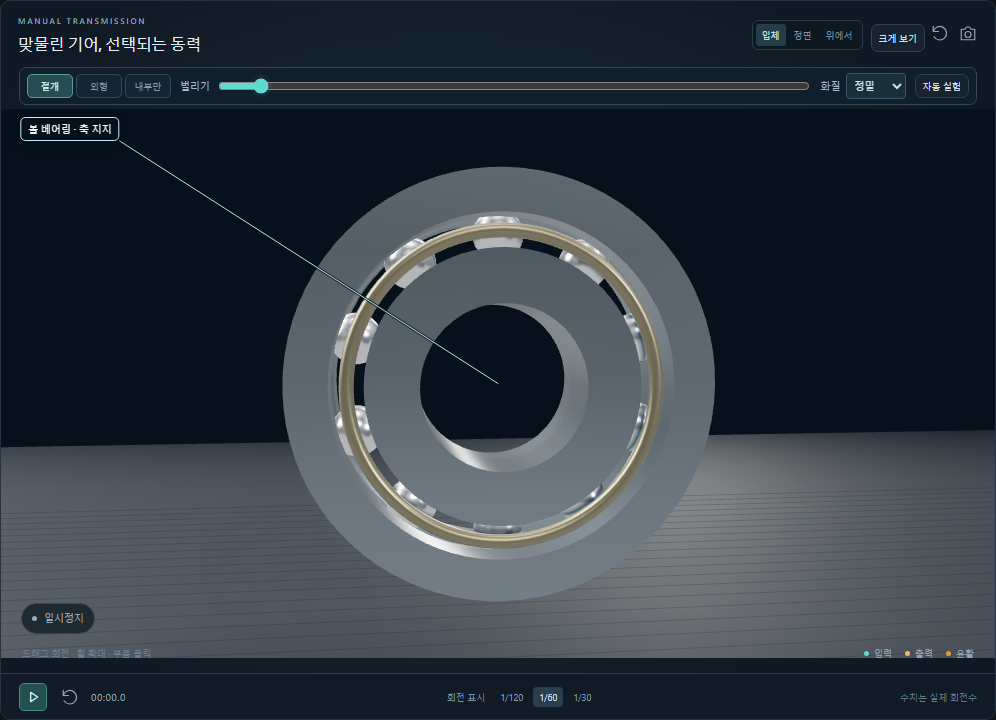
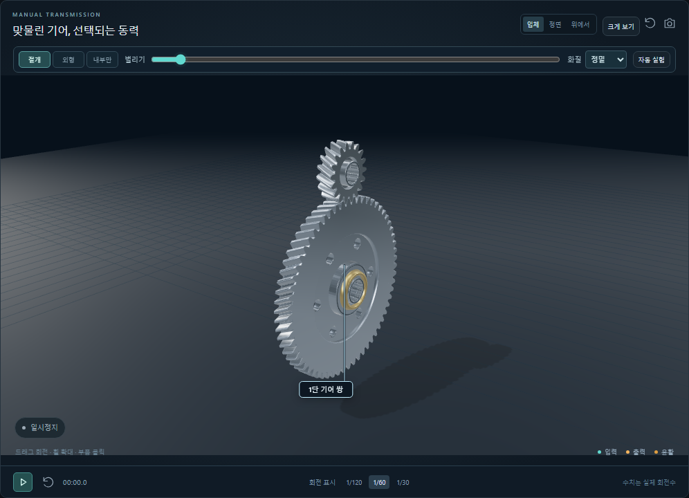

# 1.4.0 구조와 작동 상세 개선

2026-10-02, 공개 1.3.0 소스를 기준으로 한 개선입니다. 기존 설치본의 실제 설치·업데이트 평가는 `consumer-release.md`에 보존하며, 이 문서는 새 소스와 검사한 산출물의 범위만 기록합니다.

## 달라진 관찰

- 링기어 치면을 자체 기초원 인벌류트로 구성하고 화질별 피치원 치두께를 유지합니다. 연삭 치면에는 방향성 금속 표면, 축방향 끝면에는 선삭 표면을 사용합니다.
- 최종 32/32 외접 기어와 두 후진 맞물림의 초기 위상을 중심선 각도·잇수로 맞춥니다. 기존 30° 간격 오프셋의 유성기어는 이미 정상 위상이므로 보존합니다.
- 볼 베어링에 오목한 궤도 홈을 표시하고, 표시 반지름으로 케이지 공전과 볼 자전을 구합니다. 볼의 어두운 띠는 회전을 보기 위한 표식입니다. 외륜은 고정되고 내륜은 해당 축과 회전합니다.
- 부품 설명에서 **부품 단독 확대**와 **전체 구조**로 시점을 바꿉니다. 베어링은 첫 번째 지지 베어링을 확대하며 작동 상세도 그 베어링을 기준으로 합니다. 확대 중에는 다른 부품을 임시로 숨겨 가림을 없애고, 전체 구조로 돌아가면 기존 표시 설정을 복원합니다.
- 클러치 회전차·미끄럼 손실, 톱니 통과 빈도, 벨트 순환·감김각·이상 접선력, 고정 브레이크 반력을 현재 계산값에서 읽습니다. 정지 중에도 조건을 바꾸면 갱신합니다. 손실 동력은 부품 온도가 아니며, 톱니 빈도는 소음 크기가 아닙니다.

## 베어링 표시 가정

접촉각 0°, 강체 원형 궤도와 미끄럼 없는 운동을 가정합니다. 볼 중심 반지름 `R`, 볼 반지름 `r`, 내륜 각속도 `wi`, 외륜 `wo`일 때:

- 케이지: `wc = ((1-r/R)wi + (1+r/R)wo)/2`
- 케이지 기준 볼 자전: `wb_rel = -(R/r-r/R)(wi-wo)/2`
- 고정 좌표 볼 자전: `wb = wc + wb_rel`

볼을 케이지의 자식으로 그리므로 표시 회전에는 `wb_rel`을 사용합니다. 두 접촉점 속도가 각각 `(R-r)wi`, `(R+r)wo`와 일치하는지 검사합니다. [SKF 기술 자료의 FTF·BSF](https://cdn.skfmediahub.skf.com/api/public/0901d1968020b9ca/pdf_preview_medium/0901d1968020b9ca_pdf_preview_medium.pdf)의 이상 운동 관계와 대조했습니다. 하중 분포·탄성 접촉·미끄럼·수명은 계산하지 않습니다.

표시 메시에는 유한한 표면 분할 오차가 있습니다. 제조 공차·백래시·접촉 응력 또는 엄밀한 CAD 무간섭 검증을 의미하지 않습니다. 수치 모델의 경계조건과 추가 관찰값은 [모델 설명](model.md)에 있습니다.

## 검증

- 모델·형상·프로젝트·새 작동 상세·운동학: **65개 통과**.
- 정적 웹 빌드: 통과.
- 기본 브라우저 조작: **23개 통과**.
- 실험·비교·저장·반응형·화질: **12개 통과**.
- 장면·이름표·회전·문맥 복구: **10개 통과**, 수집 오류 0.
- 새 상세 표시·단독 확대·설정 복원·DCT 베어링 기준·저장·회전 위상: **11개 통과**, 수집 오류 0.
- 소스 데스크톱 앱: **15개 통과**. 독립 실행 배포 EXE: **15개 통과**.
- Windows x64 설치 파일 및 SHA-256 생성. 새 설치 파일의 실제 설치·기존 설치본 교체는 이번 개선에서 수행하지 않았습니다.
- 화면은 직접 열어 확인했고, 베어링 축방향 단독 보기와 선택 기어 쌍을 아래에 기록합니다.

로컬 검사 환경: Windows 11 x64, Node.js 24.12.0, Electron 44.5.1. 일부 브라우저 검사는 ANGLE SwiftShader를 사용하므로 측정된 렌더 시간은 사용자 GPU 성능이 아닙니다. 원격 CI 결과는 GitHub Actions에서 별도로 확인합니다.

검증 결과를 재현하려면 `npm test`, `npm run build`, `npm run test:browser`, `npm run test:consumer`, `npm run test:scene-product`, `npm run test:detail`, `npm run test:desktop`을 실행합니다.
